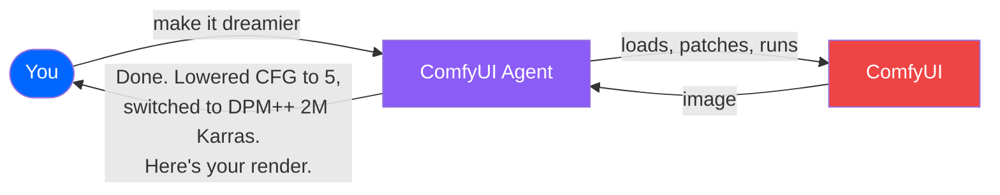
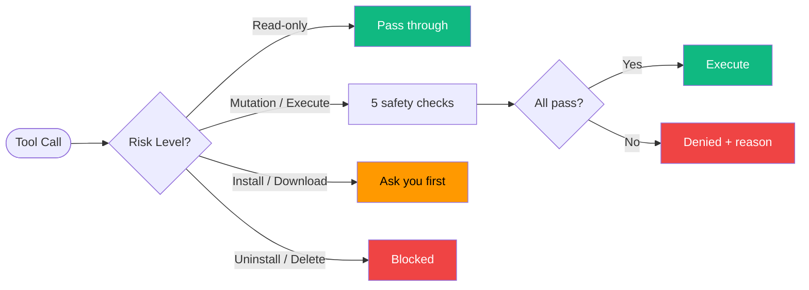
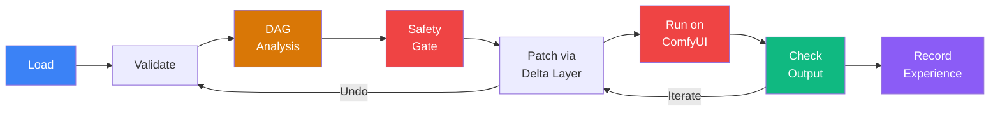

# Comfy Cozy

**Talk to ComfyUI like a colleague. It talks back.**

You describe what you want in plain English. The agent loads workflows, swaps models, tweaks parameters, installs missing nodes, runs generations, analyzes outputs, and learns what works for you -- all without you touching JSON or hunting through menus.



> **Session 1** is a capable tool.<br/>
> **Session 100** is a capable tool that knows your style.

---

## See It In Action

| You say | What happens |
|---------|-------------|
| *"Load my portrait workflow and make it dreamier"* | Loads the file, lowers CFG, switches sampler, saves with full undo |
| *"Repair this workflow"* | Finds the missing nodes, installs the packs, fixes the connections |
| *"Download the Flux dev checkpoint"* | Downloads it to the right folder, verifies the hash |
| *"Run this with 30 steps"* | Patches the workflow, validates it, queues it to ComfyUI, shows progress |
| *"Analyze this output"* | Uses Claude Vision to diagnose issues and suggest parameter changes |
| *"What model should I use for anime?"* | Searches CivitAI + HuggingFace + your local models, recommends the best fit |
| *"Optimize this for speed"* | Profiles GPU usage, checks TensorRT eligibility, applies optimizations |

---

## Get Running in 5 Minutes

**Before you start, you need three things:**

- [ ] **Python 3.10+** installed ([python.org/downloads](https://python.org/downloads) -- grab the latest)
- [ ] **ComfyUI** installed and running on your machine ([github.com/comfyanonymous/ComfyUI](https://github.com/comfyanonymous/ComfyUI))
- [ ] **An Anthropic API key** ([console.anthropic.com](https://console.anthropic.com/) -- sign up, create a key)

Got all three? Here we go.

### Step 1: Download the agent

Open a terminal (Command Prompt, PowerShell, or Terminal) and run:

```bash
git clone https://github.com/JosephOIbrahim/comfyui-agent.git
cd comfyui-agent
```

### Step 2: Install it

```bash
pip install -e .
```

That's it. One command. If you want to run the test suite too:

```bash
pip install -e ".[dev]"
```

### Step 3: Add your API key

```bash
cp .env.example .env
```

Open the `.env` file in any text editor and paste your key:

```
ANTHROPIC_API_KEY=sk-ant-your-key-here
```

**If your ComfyUI folder isn't in the default location**, also add:

```
COMFYUI_DATABASE=C:/path/to/your/ComfyUI
```

### Step 4: Go

Make sure ComfyUI is running, then:

```bash
agent run
```

Type what you want. Type `quit` when you're done. That's it.

---

## Two Ways to Use It

### Option A: Inside Claude Code / Claude Desktop (recommended)

The agent runs as an MCP server -- Claude can use all 108+ tools directly.

Add this to your Claude Code or Claude Desktop MCP config:

```json
{
  "mcpServers": {
    "comfyui-agent": {
      "command": "agent",
      "args": ["mcp"]
    }
  }
}
```

Now just talk to Claude about your ComfyUI workflows. It has full access.

### Option B: Standalone CLI

```bash
agent run                        # Start a conversation
agent run --session my-project   # Auto-saves so you can pick up later
agent run --verbose              # See what's happening under the hood
```

### Handy CLI Commands (no API key needed)

```bash
agent inspect                    # See your installed models and nodes
agent parse workflow.json        # Analyze a workflow file
agent sessions                   # List your saved sessions
```

---

## What the Agent Knows About Your Models

The agent ships with built-in knowledge about how each model family actually behaves. It won't use SD 1.5 settings on a Flux workflow.

| Model | Resolution | CFG | Notes |
|-------|-----------|-----|-------|
| **SD 1.5** | 512x512 | 7-12 | Huge LoRA ecosystem. Negative prompts matter. |
| **SDXL** | 1024x1024 | 5-9 | Better anatomy. Tag-based prompts work best. |
| **Flux** | 512-1024 | ~1.0 (guidance) | No negative prompts. Needs FluxGuidance node + T5 encoder. |
| **SD3** | 1024x1024 | 5-7 | Triple text encoder (CLIP-G, CLIP-L, T5). |
| **LTX-2** (video) | 768x512 | ~25 | 121 steps. Frame count must be (N*8)+1. |
| **WAN 2.x** (video) | 832x480 | 1-3.5 | Dual-noise architecture. 4-20 steps. |

**The agent will never mix model families** -- no SD 1.5 LoRAs on SDXL checkpoints, no Flux ControlNets on SD3.

### Artist-Speak Translation

| You say | What the agent adjusts |
|---------|----------------------|
| *"dreamier"* or *"softer"* | Lower CFG (5-7), more steps, DPM++ 2M Karras |
| *"sharper"* or *"crisper"* | Higher CFG (8-12), Euler or DPM++ SDE |
| *"more photorealistic"* | CFG 7-10, realistic checkpoint, negative: "cartoon, anime" |
| *"more stylized"* | Lower CFG (4-6), artistic checkpoint or LoRA |
| *"faster"* | Fewer steps (15-20), LCM/Lightning/Turbo, smaller resolution |
| *"higher quality"* | More steps (30-50), hires fix, upscaler |
| *"more variation"* | Higher denoise, different seed, lower CFG |
| *"less variation"* | Lower denoise, same seed, higher CFG |

---

## How It Works (The Short Version)


**Four phases, always in order:**

1. **UNDERSTAND** -- Reads your workflow, scans your models, checks what's installed
2. **DISCOVER** -- Searches for what you need across CivitAI, HuggingFace, ComfyUI Manager (31k+ nodes)
3. **PILOT** -- Makes changes through safe, reversible delta layers (never edits your original)
4. **VERIFY** -- Runs the workflow, checks the output, records what worked

Every change is undoable. Every generation teaches the agent something.

---

## Comfy Cozy Panel (ComfyUI Sidebar)

A Pentagram-inspired sidebar that lives right inside ComfyUI:

- **APP Mode** -- Chat with the agent, see tool cards and streaming responses
- **GRAPH Mode** -- Inspect your workflow's delta layers and LIVRPS opinions per parameter
- **Experience Dashboard** -- See what the agent has learned about your style
- **Autoresearch Monitor** -- Watch quality improve across iterations

Design: monochrome + one accent (#0066FF on #0D0D0D). Inter typography. No gradients, no shadows. Every pixel earns its place.

---

<details>
<summary><b>Architecture Deep Dive</b> (click to expand)</summary>

### Seven Structural Subsystems

The agent is built on seven architectural subsystems. Each one degrades independently -- if one breaks, the rest keep working.


### Workflow Intelligence DAG

Before any workflow runs, a DAG of pure functions analyzes it:


### Pre-Dispatch Safety Gate

Every tool call passes through a default-deny gate. Read-only tools bypass it (zero overhead). Destructive tools are always locked.



### LIVRPS -- How Conflicts Get Resolved

All workflow changes are non-destructive layers. When two opinions conflict:

| Priority | Layer | Example |
|----------|-------|---------|
| 6 (strongest) | **Safety** | "CFG above 30 is degenerate" -- always wins |
| 5 | **Local** (your edit) | "Set CFG to 9" |
| 4 | **Inherits** (experience) | "CFG 7.5 worked better last time" |
| 3 | **VariantSets** | Creative profile presets |
| 2 | **References** | Learned recipes |
| 1 (weakest) | **Payloads** | Default template values |

Your edit beats experience. Safety beats everything. Every conflict is deterministic, transparent, and reversible.

### Graceful Degradation

Every subsystem has an independent kill switch. Set any of these to `0` in your `.env` to disable:

`STAGE_ENABLED` `BRAIN_ENABLED` `CWM_ENABLED` `DAG_ENABLED` `GATE_ENABLED` `OBSERVATION_ENABLED` `VISION_ENABLED` `DISCOVERY_ENABLED`

All default to ON. The agent works fine with any combination disabled -- features just gracefully disappear.

### Experience Loop

Every generation is an experiment. The agent tracks what worked:

- **Sessions 1-30**: Uses built-in knowledge only
- **Sessions 30-100**: Blends knowledge with what it's learned from your renders
- **Sessions 100+**: Primarily driven by your personal history

### Tool Inventory

**108+ tools across three layers:**

| Layer | Count | Highlights |
|-------|-------|-----------|
| **Intelligence** | 58 | Workflow parsing, model search (CivitAI + HF + 31k nodes), delta patching, execution, verification |
| **Brain** | 27 | Vision analysis, goal planning, pattern memory, GPU optimization, artistic intent capture |
| **Stage** | 23 | USD cognitive state, LIVRPS composition, predictive experiments, scene composition |

### Workflow Lifecycle



### Project Structure

```
agent/
  tools/              58 tools — workflow ops, model search, execution
  brain/              27 tools — vision, planning, memory, optimization
    adapters/         Pure-function translators between brain modules
  stage/              23 tools — USD state, prediction, composition
    dag/              Workflow intelligence (6 computation nodes)
  gate/               Pre-dispatch safety (5-check pipeline)
  degradation.py      Fault isolation manager
  config.py           Environment + 8 kill switches
  mcp_server.py       MCP server (primary interface)
tests/                2800+ tests, all mocked, <60s
```

### Production Hardening

| Domain | What it means |
|--------|-------------|
| **Safety** | 5-check default-deny gate. Risk levels 0-4. Destructive ops never auto-execute. |
| **Fault Isolation** | Each subsystem fails independently. Circuit breakers prevent cascading failures. |
| **Determinism** | Pure computation DAG. Deterministic JSON. Ordinal state enums. Same input = same output. |
| **Audit Trail** | Every mutation logged: who changed what, when, and what got overridden. |
| **Security** | Path traversal blocked. SSRF prevented. Private IPs rejected. SHA-256 on all delta layers. |

</details>

---

## Configuration

All settings live in your `.env` file:

| Setting | Default | What it does |
|---------|---------|-------------|
| `ANTHROPIC_API_KEY` | *(required)* | Your Claude API key |
| `COMFYUI_HOST` | `127.0.0.1` | Where ComfyUI runs |
| `COMFYUI_PORT` | `8188` | ComfyUI port |
| `COMFYUI_DATABASE` | `~/ComfyUI` | Your ComfyUI folder (models, nodes, workflows) |
| `AGENT_MODEL` | `claude-sonnet-4-20250514` | Which Claude model (CLI mode only) |

---

## Testing

No ComfyUI needed -- everything is mocked:

```bash
python -m pytest tests/ -v        # 2800+ tests, under 60 seconds
```

---

## License

[MIT](LICENSE) -- use it however you want.
