# ComfyUI Agent

**The first AI generation tool that gets better at your job by doing your job.**

AI co-pilot for [ComfyUI](https://github.com/comfyanonymous/ComfyUI) — 108+ tools, a cognitive architecture that learns from every generation, and a Pentagram-inspired UI panel. Instead of manually editing JSON, hunting for node packs, or debugging broken workflows, just describe what you want.

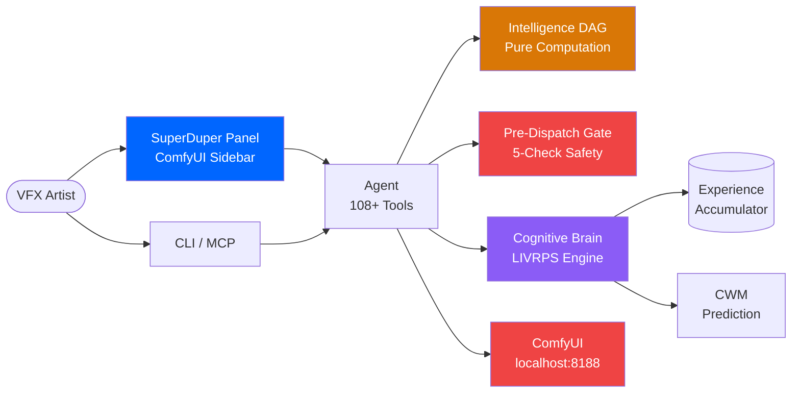

---

## What It Does

| You say | The agent does |
|---------|---------------|
| **"Cinematic portrait, golden hour, film grain"** | Composes a workflow from capability matching, predicts quality, generates |
| **"Load this workflow and change the seed to 42"** | Reads, modifies via non-destructive delta layers, saves with full undo |
| **"Repair this workflow"** | Detects missing nodes, finds the packs, installs them all in one shot |
| **"Reconfigure for my local models"** | Scans model references, fuzzy-matches closest local alternative |
| **"Download the LTX-2 FP8 checkpoint"** | Downloads models directly to the correct directory |
| **"Run this with 30 steps"** | Patches via LIVRPS composition, validates against schema, queues to ComfyUI |
| **"Analyze this output"** | Claude Vision diagnoses image issues with parameter-aware suggestions |
| **"Optimize this portrait workflow overnight"** | Autoresearch ratchet iterates parameters, quality only goes up |

The agent gets measurably better over time. Session 1 is a capable tool. Session 100 is a capable tool that knows your style.

---

## Architecture

### Seven Structural Subsystems

The agent is built on seven architectural subsystems that work together to make workflow operations deterministic, safe, and extensible. Each subsystem degrades independently via kill switches.

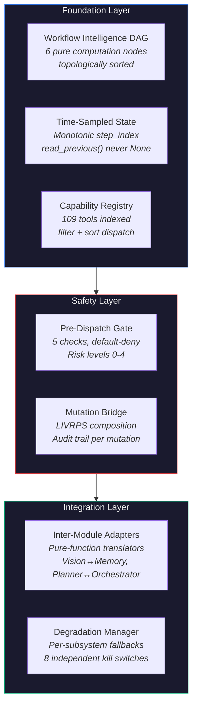

### Workflow Intelligence DAG

Pure stateless computation functions, topologically sorted. Zero internal state. Every function reads inputs and returns outputs — deterministic and independently testable.

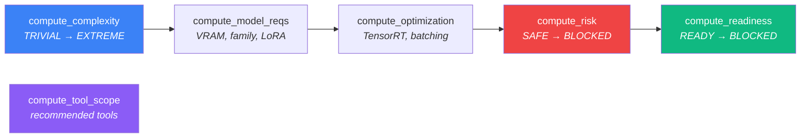

### Pre-Dispatch Gate

Default-deny. All 5 checks must pass. Risk-level classification determines which checks apply.

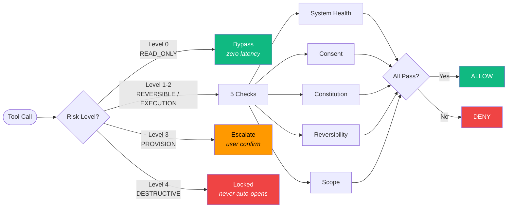

### LIVRPS Composition

All workflow mutations are non-destructive delta layers. When opinions conflict, LIVRPS determines who wins:

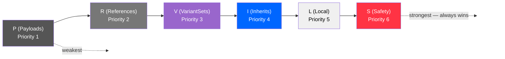

- **Your edit** says CFG 9 (Local, priority 5)
- **Experience** says CFG 7.5 works better (Inherits, priority 4)
- **Safety** says CFG above 30 is degenerate (Safety, priority 6)
- Resolution: Safety overrides everything. Then your local edits. Then experience. Every conflict is deterministic, transparent, and reversible.

### Cognitive Brain

Six layers of capability, each building on the previous:

```mermaid
graph TB
    subgraph Phase1 ["Phase 1: State Spine"]
        Engine[CognitiveGraphEngine<br/>LIVRPS Composition]
        Delta[Delta Layers<br/>SHA-256 Integrity]
        Models[ComfyNode / WorkflowGraph<br/>Typed Models]
    end

    subgraph Phase2 ["Phase 2: Transport"]
        Schema[SchemaCache<br/>Mutation Validation]
        Events[ExecutionEvent<br/>Typed WS Messages]
    end

    subgraph Phase3 ["Phase 3: Macro-Tools"]
        Analyze[analyze_workflow]
        Mutate[mutate_workflow]
        Compose[compose_workflow]
        Execute[execute_workflow]
    end

    subgraph Phase4 ["Phase 4: Experience"]
        Chunk[ExperienceChunk<br/>Params → Outcome]
        Sig[ContextSignature<br/>Fast Matching]
        Acc[Accumulator<br/>3-Phase Learning]
    end

    subgraph Phase5 ["Phase 5: Prediction"]
        CWM[Cognitive World Model<br/>LIVRPS Prediction]
        Arbiter[Simulation Arbiter<br/>Silent / Soft / Explicit]
        CF[Counterfactuals<br/>What-If Experiments]
    end

    subgraph Phase6 ["Phase 6: Autonomous Pipeline"]
        Pipeline[Intent → Compose → Predict<br/>→ Execute → Evaluate → Learn]
    end

    Phase1 --> Phase2 --> Phase3
    Phase3 --> Phase4 --> Phase5 --> Phase6

    style Phase1 fill:#1a1a2e,color:#F0F0F0
    style Phase2 fill:#1a1a2e,color:#F0F0F0
    style Phase3 fill:#1a1a2e,color:#F0F0F0
    style Phase4 fill:#1a1a2e,color:#F0F0F0
    style Phase5 fill:#1a1a2e,color:#F0F0F0
    style Phase6 fill:#1a1a2e,color:#F0F0F0
```

### Experience Loop

Every generation is an experiment with a typed result:

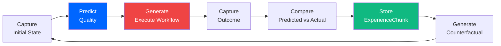

Three learning phases:
- **Phase 1** (0-30 generations): Prior rules only
- **Phase 2** (30-100): Blended prior + experience
- **Phase 3** (100+): Experience-dominant -- the agent knows your style

### Graceful Degradation

Every subsystem has an independent kill switch and fallback. The MCP server never crashes.

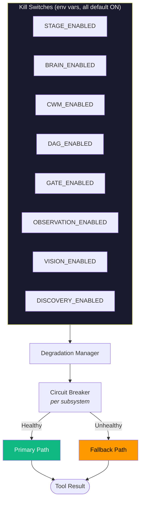

---

## Installation

**Requirements:**
- Python 3.10+
- ComfyUI running on your machine
- An Anthropic API key ([console.anthropic.com](https://console.anthropic.com/))

```bash
git clone https://github.com/JosephOIbrahim/comfyui-agent.git
cd comfyui-agent
pip install -e ".[dev]"
cp .env.example .env
# Edit .env — add your ANTHROPIC_API_KEY
```

### Run

```bash
agent run              # Interactive CLI session
agent mcp              # MCP server (primary interface)
```

### MCP Configuration

```json
{
  "mcpServers": {
    "comfyui-agent": {
      "command": "agent",
      "args": ["mcp"]
    }
  }
}
```

---

## Tool Layer Architecture

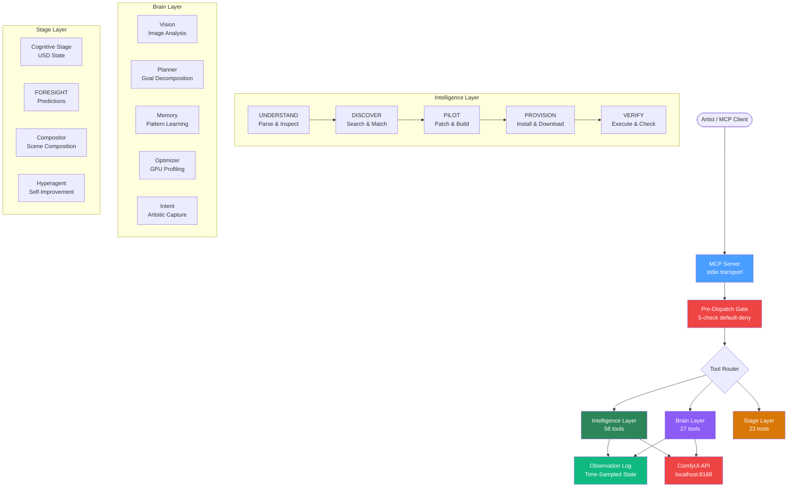

### Intelligence Layer (58 tools)

| Phase | Tools | What they do |
|-------|-------|-------------|
| **UNDERSTAND** | 13 | Parse workflows (including component/subgraph format), scan models/nodes, query ComfyUI API |
| **DISCOVER** | 15 | Search local catalog + ComfyUI Manager (31k+ nodes) + HuggingFace + CivitAI |
| **PILOT** | 16 | Non-destructive delta patches via CognitiveGraphEngine, semantic node ops |
| **PROVISION** | 5 | Install node packs, download models, one-shot workflow repair |
| **VERIFY** | 9 | Schema-validated execution, WebSocket progress, creative metadata embedding |

### Brain Layer (27 tools)

| Module | Tools | What they do |
|--------|-------|-------------|
| **Vision** | 4 | Analyze generated images, A/B comparison, perceptual hashing |
| **Planner** | 4 | Goal decomposition, step tracking, replanning |
| **Memory** | 4 | Outcome learning with temporal decay, cross-session patterns |
| **Orchestrator** | 2 | Parallel sub-tasks with filtered tool access |
| **Optimizer** | 4 | GPU profiling, TensorRT detection, auto-apply optimizations |
| **Demo** | 2 | Guided walkthroughs for streams and podcasts |
| **Intent** | 4 | Artistic intent capture, MoE pipeline with iterative refinement |
| **Iteration** | 3 | Refinement journey tracking across generation cycles |

### Stage Layer (23 tools)

| Module | Tools | What they do |
|--------|-------|-------------|
| **Provisioner** | 3 | USD-native model provisioning with download/verify lifecycle |
| **Stage** | 6 | Cognitive state read/write with delta composition and rollback |
| **FORESIGHT** | 5 | Predictive experiment planning, experience recording, counterfactuals |
| **Compositor** | 4 | USD scene composition, validation, conditioning extraction |
| **Hyperagent** | 5 | Meta-layer self-improvement proposals, calibration tracking |

---

## Model Profiles

| Profile | Architecture | Key Insight |
|---------|-------------|-------------|
| **Flux.1 Dev** | DiT | CFG 2.5-4.5, T5-XXL encoder, negative prompts near-useless |
| **SDXL** | UNet | CFG 5-9, CLIP encoder, tag-based prompts, LoRA ecosystem |
| **SD 1.5** | UNet | CFG 7-12, 512x512 native, massive LoRA support |
| **LTX-2** | DiT (video) | CFG ~25, 121 steps, Gemma-3 encoder, frame count must be (N*8)+1 |
| **WAN 2.x** | UNet (video) | CFG 1-3.5, 4-20 steps, dual-noise architecture, CLIP encoder |

Each profile has three sections consumed by different agents:
- **prompt_engineering** (Intent Agent) -- how to write prompts for this model
- **parameter_space** (Execution Agent) -- correct CFG, steps, sampler, resolution ranges
- **quality_signatures** (Verify Agent) -- how to judge output quality and suggest fixes

---

## Workflow Lifecycle

```mermaid
flowchart LR
    Load[Load Workflow] --> Validate[Validate<br/>Schema + Structure]
    Validate --> DAG[DAG Analysis<br/>Complexity / Risk]
    DAG --> Fields[Get Editable<br/>Fields]
    Fields --> Gate[Gate Check<br/>5-Point Safety]
    Gate --> Mutate[Mutate via<br/>Delta Layer]
    Mutate --> Bridge[Mutation Bridge<br/>LIVRPS Compose]
    Bridge --> PreExec[Pre-Execute<br/>Validation]
    PreExec --> Execute[Queue to<br/>ComfyUI]
    Execute --> Monitor[WebSocket<br/>Progress]
    Monitor --> Verify[Verify<br/>Outputs]
    Verify --> Observe[Record<br/>Observation]
    Observe --> Learn[Record<br/>Experience]

    Mutate -->|Rollback| Fields
    Verify -->|Iterate| Mutate

    style Load fill:#3b82f6,color:#fff
    style DAG fill:#d97706,color:#fff
    style Gate fill:#ef4444,color:#fff
    style Bridge fill:#8b5cf6,color:#fff
    style Execute fill:#ef4444,color:#fff
    style Verify fill:#10b981,color:#fff
    style Observe fill:#10b981,color:#fff
    style Learn fill:#8b5cf6,color:#fff
```

---

## SuperDuper Panel (ComfyUI Sidebar)

Pentagram-inspired UI panel inside ComfyUI with two modes:

**APP Mode** -- Chat interface with streaming responses, tool cards, and prediction overlays
**GRAPH Mode** -- Live workflow inspector showing delta layers, LIVRPS opinions per parameter, and inline editing

Plus dedicated views:
- **Experience Dashboard** -- learning phase progress, quality stats, top patterns, prediction accuracy chart
- **Autoresearch Monitor** -- quality trajectory, winning parameters, apply-with-one-click
- **Prediction Overlay** -- inline cards when the Simulation Arbiter surfaces a recommendation

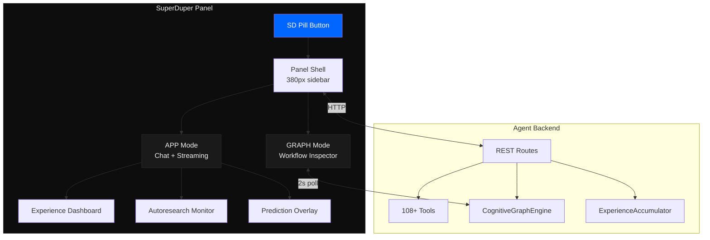

Design system: monochrome + one accent (#0066FF on #0D0D0D). Inter typography. No gradients, no shadows, 4px max radius. 1px borders. Every pixel earns its place.

---

## Security Model

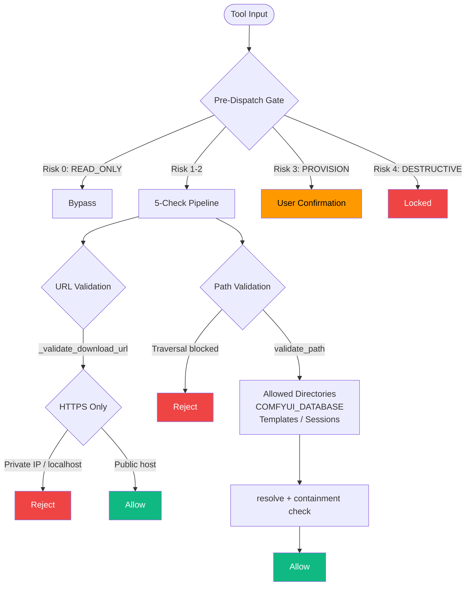

---

## Configuration

All settings go in your `.env` file:

| Setting | Default | What it does |
|---------|---------|-------------|
| `ANTHROPIC_API_KEY` | (required) | Your API key for Claude |
| `COMFYUI_HOST` | `127.0.0.1` | Where ComfyUI is running |
| `COMFYUI_PORT` | `8188` | ComfyUI port |
| `COMFYUI_DATABASE` | `~/ComfyUI` | Your ComfyUI database folder |
| `COMFYUI_INSTALL_DIR` | auto-detected | ComfyUI installation directory |
| `COMFYUI_OUTPUT_DIR` | auto-detected | Where ComfyUI saves generated images |
| `AGENT_MODEL` | `claude-sonnet-4-20250514` | Claude model (CLI mode only) |

### Kill Switches

Each architectural subsystem can be independently disabled via environment variables (all default to ON):

| Switch | Subsystem |
|--------|-----------|
| `STAGE_ENABLED` | USD Cognitive Stage (LIVRPS composition) |
| `BRAIN_ENABLED` | Brain layer (Vision, Planner, Memory, etc.) |
| `CWM_ENABLED` | Cognitive World Model predictions |
| `DAG_ENABLED` | Workflow Intelligence DAG |
| `GATE_ENABLED` | Pre-dispatch safety gate |
| `OBSERVATION_ENABLED` | Time-sampled workflow state logging |
| `VISION_ENABLED` | Image analysis via Anthropic API |
| `DISCOVERY_ENABLED` | CivitAI / HuggingFace federation |

---

## Project Structure

```
comfyui-agent/
├── agent/                      # Agent package (108+ tools)
│   ├── tools/                  # Intelligence layer (58 tools)
│   │   ├── capability_registry.py   # Capability-matching dispatch (Hydra)
│   │   └── capability_defaults.py   # 109 tool capability definitions
│   ├── brain/                  # Brain layer (27 tools)
│   │   └── adapters/           # Inter-module translators (pure functions)
│   ├── stage/                  # Stage layer (23 tools)
│   │   ├── dag/                # Workflow Intelligence DAG (6 computations)
│   │   ├── mutation_bridge.py  # LIVRPS mutation routing + audit trail
│   │   └── cognitive_stage.py  # USD-native LIVRPS composition
│   ├── gate/                   # Pre-dispatch gate (5-check safety)
│   │   ├── pre_dispatch.py     # Default-deny gate pipeline
│   │   ├── risk_levels.py      # Risk classification for all tools
│   │   └── checks.py           # 5 individual check implementations
│   ├── degradation.py          # Fault isolation manager
│   ├── workflow_observation.py # Time-sampled state (IntEnums + dataclasses)
│   ├── workflow_observation_log.py  # Observation log (BASELINE never None)
│   ├── mcp_server.py           # MCP server exposing all tools
│   ├── cli.py                  # CLI entry points
│   ├── config.py               # Environment + kill switches
│   └── session_context.py      # Per-session state management
├── tests/                      # 2800+ tests, all mocked, <60s
├── PRODUCT_VISION.md           # What this product feels like
└── PANEL_DESIGN.md             # SuperDuper Panel component architecture
```

---

## Testing

Tests run without ComfyUI -- everything is mocked:

```bash
python -m pytest tests/ -v        # 2800+ tests, all mocked, under 60 seconds
ruff check agent/ tests/          # Lint
ruff format agent/ tests/         # Format
```

---

## Production Hardening

| Domain | Implementation |
|--------|---------------|
| **Safety Gate** | Default-deny pre-dispatch gate with 5 checks (health, consent, constitution, reversibility, scope). Risk levels 0-4. Destructive ops never auto-open. |
| **Fault Isolation** | DegradationManager with per-subsystem circuit breakers. 8 independent kill switches. MCP server never crashes regardless of subsystem state. |
| **Determinism** | Pure computation DAG (networkx topological sort). He2025 deterministic JSON (`sort_keys=True`). Ordinal IntEnums for inequality comparisons. |
| **Auditability** | Mutation Bridge records every change (who, what, when, overridden by whom). Time-sampled observation log with monotonic step_index. |
| **Security** | Path traversal protection, SSRF prevention (HTTPS-only, private IP blocking), session name validation. SHA-256 on all delta layers. |
| **State Safety** | Atomic file writes, TOCTOU race fixes, thread-safety via RLock across all mutable state. `BASELINE_OBSERVATION` guarantee: `read_previous(0)` never returns None. |

---

## License

[MIT](LICENSE) -- use it however you want.
