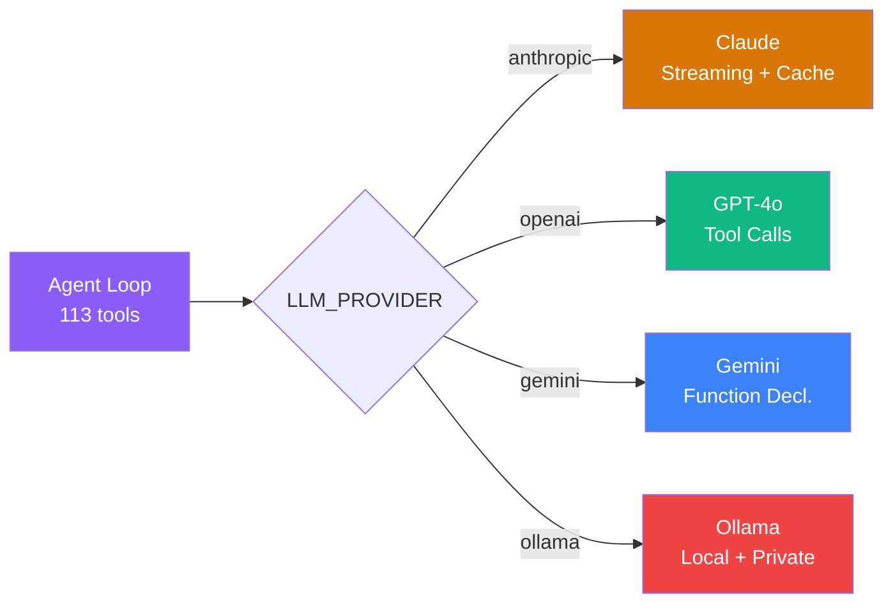
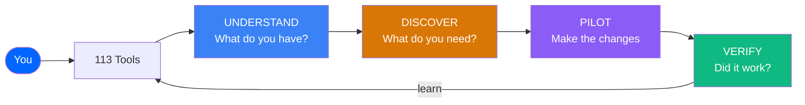
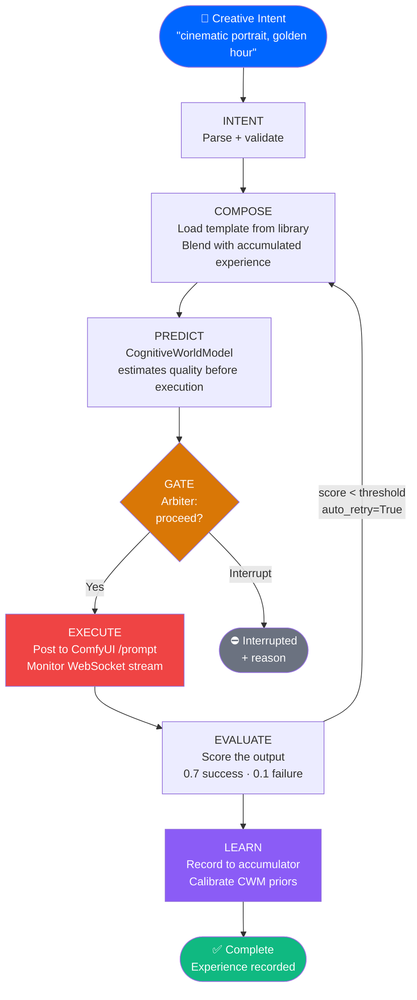
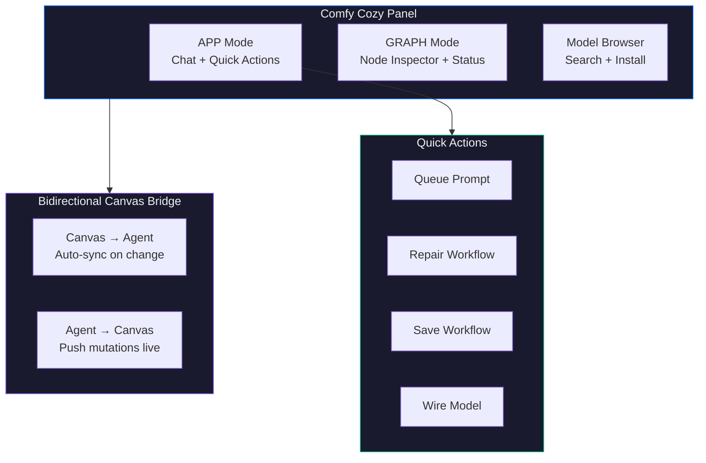
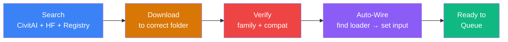
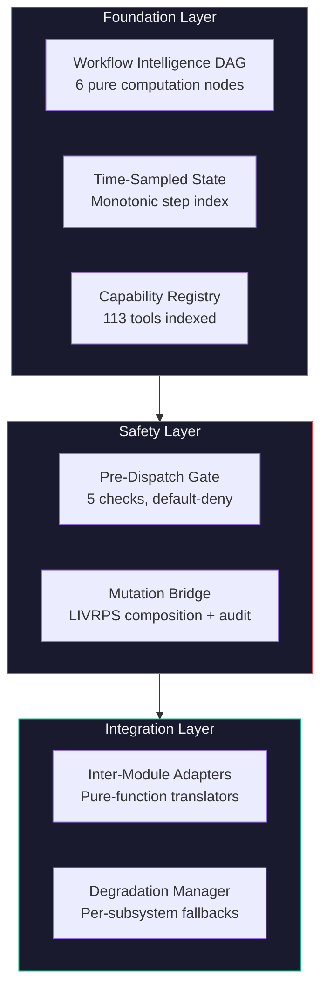
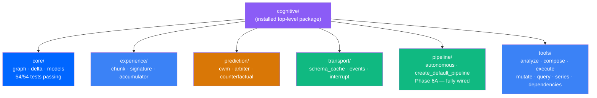
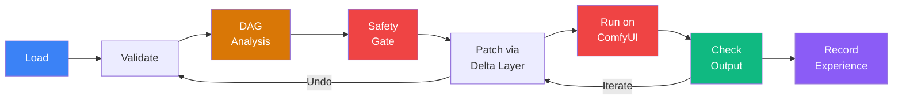

<p align="center">
  
</p>

<p align="center">
  <strong>Patent Pending</strong> &nbsp;|&nbsp; <a href="LICENSE">MIT License</a> &nbsp;|&nbsp; <a href="https://github.com/JosephOIbrahim/Harlo/blob/main/PATENTS.md">Patent Details</a>
</p>

# Comfy Cozy

**Talk to ComfyUI like a colleague. It talks back.**

You describe what you want in plain English. The agent loads workflows, swaps models, tweaks parameters, installs missing nodes, runs generations, analyzes outputs, and learns what works for you -- all without you touching JSON or hunting through menus.


> **Session 1** is a capable tool.<br/>
> **Session 100** is a capable tool that knows your style.

---

## See It In Action

| You say | What happens |
|---------|-------------|
| *"Load my portrait workflow and make it dreamier"* | Loads the file, lowers CFG, switches sampler, saves with full undo |
| *"I want to use Flux"* | Searches CivitAI + HuggingFace, downloads the model, wires it into your workflow |
| *"Repair this workflow"* | Finds missing nodes, installs the packs, fixes connections, migrates deprecated nodes |
| *"Run this with 30 steps"* | Patches the workflow, validates it, queues it to ComfyUI, shows progress |
| *"Analyze this output"* | Uses Vision AI to diagnose issues and suggest parameter changes |
| *"What model should I use for anime?"* | Searches CivitAI + HuggingFace + your local models, recommends the best fit |
| *"Optimize this for speed"* | Profiles GPU usage, checks TensorRT eligibility, applies optimizations |

---

## Get Running in 5 Minutes

**Before you start, you need three things:**

- [ ] **Python 3.11+** ([python.org/downloads](https://python.org/downloads))
- [ ] **ComfyUI** running on your machine ([github.com/comfyanonymous/ComfyUI](https://github.com/comfyanonymous/ComfyUI))
- [ ] **One LLM backend** -- an API key from Anthropic, OpenAI, or Google, OR [Ollama](https://ollama.com) installed locally (free, no API key)

Got all three? Here we go.

### Step 1: Download the agent

```bash
git clone https://github.com/JosephOIbrahim/Comfy-Cozy.git
cd Comfy-Cozy
```

### Step 2: Install it

```bash
pip install -e .                  # core install (agent + cognitive engine + panel)
pip install -e ".[dev]"           # + full test suite (2717 passing tests)
pip install -e ".[dev,stage]"     # + USD stage subsystem (~200MB, optional)
```

The core install is all you need to run the agent. Add `[dev]` to run the test suite. Add `[stage]` only if you need the USD-backed provisioner — it's a heavy native dependency and most users don't need it.

> **Requires Python 3.11+.** ComfyUI also requires 3.11+ — if ComfyUI runs on your machine, you already have the right version.

### Step 3: Add your API key

```bash
cp .env.example .env
```

Open `.env` and configure your LLM provider -- pick any one:

```bash
# Option 1: Anthropic (default)
ANTHROPIC_API_KEY=sk-ant-your-key-here

# Option 2: OpenAI (requires: pip install openai)
LLM_PROVIDER=openai
OPENAI_API_KEY=sk-your-key-here

# Option 3: Gemini (requires: pip install google-genai)
LLM_PROVIDER=gemini
GEMINI_API_KEY=your-key-here

# Option 4: Ollama (requires: ollama installed locally — no API key)
LLM_PROVIDER=ollama
```

See [Pick Your LLM](#pick-your-llm) for full details.

**If your ComfyUI folder isn't in the default location**, also add:

```
COMFYUI_DATABASE=C:/path/to/your/ComfyUI
```

### Step 4: Go

Make sure ComfyUI is running, then:

```bash
agent run
```

Type what you want. Type `quit` when you're done. That's it.

---

## Pick Your LLM

Comfy Cozy is **provider-agnostic**. The same 113 tools, the same streaming interface, the same vision analysis -- just swap the backend.

### Anthropic (default)

```bash
# .env
ANTHROPIC_API_KEY=sk-ant-your-key-here

# Run
agent run
```

Ships as the default. No extra install needed. Supports prompt caching for lower costs on long sessions.

### OpenAI

```bash
# Install the SDK (one time)
pip install openai

# .env
LLM_PROVIDER=openai
OPENAI_API_KEY=sk-your-key-here
AGENT_MODEL=gpt-4o           # or gpt-4o-mini for faster/cheaper

# Run
agent run
```

Full tool-use support with streaming. Works with any OpenAI-compatible endpoint.

### Google Gemini

```bash
# Install the SDK (one time)
pip install google-genai

# .env
LLM_PROVIDER=gemini
GEMINI_API_KEY=your-key-here
AGENT_MODEL=gemini-2.5-flash  # or gemini-2.5-pro

# Run
agent run
```

Function declarations mapped automatically. Supports Gemini's thinking mode.

### Ollama (fully local, no API key)

```bash
# Install Ollama: https://ollama.com
# Pull a model
ollama pull llama3.1

# .env
LLM_PROVIDER=ollama
AGENT_MODEL=llama3.1          # or any model you've pulled

# Run (no API key needed)
agent run
```

Uses Ollama's OpenAI-compatible endpoint at `localhost:11434`. Override with `OLLAMA_BASE_URL` if running remotely. **No data leaves your machine.**

### Architecture

All four providers share the same abstraction layer (`agent/llm/`):



Common types (`TextBlock`, `ToolUseBlock`, `LLMResponse`), unified error hierarchy, provider-specific format conversion handled internally. Switch providers with one env var -- no code changes.

---

## Two Ways to Use It

### Option A: Inside Claude Code / Claude Desktop (recommended)

The agent runs as an MCP server -- Claude can use all 113 tools directly.

Add this to your Claude Code or Claude Desktop MCP config:

```json
{
  "mcpServers": {
    "comfyui-agent": {
      "command": "agent",
      "args": ["mcp"]
    }
  }
}
```

Now just talk to Claude about your ComfyUI workflows. It has full access.

### Option B: Standalone CLI

```bash
agent run                        # Start a conversation
agent run --session my-project   # Auto-saves so you can pick up later
agent run --verbose              # See what's happening under the hood
```

### Handy CLI Commands (no API key needed)

```bash
agent inspect                    # See your installed models and nodes
agent parse workflow.json        # Analyze a workflow file
agent sessions                   # List your saved sessions
```

---

## What the Agent Knows About Your Models

The agent ships with built-in knowledge about how each model family actually behaves. It won't use SD 1.5 settings on a Flux workflow.

| Model | Resolution | CFG | Notes |
|-------|-----------|-----|-------|
| **SD 1.5** | 512x512 | 7-12 | Huge LoRA ecosystem. Negative prompts matter. |
| **SDXL** | 1024x1024 | 5-9 | Better anatomy. Tag-based prompts work best. |
| **Flux** | 512-1024 | ~1.0 (guidance) | No negative prompts. Needs FluxGuidance node + T5 encoder. |
| **SD3** | 1024x1024 | 5-7 | Triple text encoder (CLIP-G, CLIP-L, T5). |
| **LTX-2** (video) | 768x512 | ~25 | 121 steps. Frame count must be (N*8)+1. |
| **WAN 2.x** (video) | 832x480 | 1-3.5 | Dual-noise architecture. 4-20 steps. |

**The agent will never mix model families** -- no SD 1.5 LoRAs on SDXL checkpoints, no Flux ControlNets on SD3.

### Artist-Speak Translation

| You say | What the agent adjusts |
|---------|----------------------|
| *"dreamier"* or *"softer"* | Lower CFG (5-7), more steps, DPM++ 2M Karras |
| *"sharper"* or *"crisper"* | Higher CFG (8-12), Euler or DPM++ SDE |
| *"more photorealistic"* | CFG 7-10, realistic checkpoint, negative: "cartoon, anime" |
| *"more stylized"* | Lower CFG (4-6), artistic checkpoint or LoRA |
| *"faster"* | Fewer steps (15-20), LCM/Lightning/Turbo, smaller resolution |
| *"higher quality"* | More steps (30-50), hires fix, upscaler |
| *"more variation"* | Higher denoise, different seed, lower CFG |
| *"less variation"* | Lower denoise, same seed, higher CFG |

---

## How It Works



**Four phases, always in order:**

1. **UNDERSTAND** -- Reads your workflow, scans your models, checks what's installed
2. **DISCOVER** -- Searches CivitAI, HuggingFace, ComfyUI Manager (31k+ nodes)
3. **PILOT** -- Makes changes through safe, reversible delta layers (never edits your original)
4. **VERIFY** -- Runs the workflow, checks the output, records what worked

Every change is undoable. Every generation teaches the agent something.

---

## Autonomous Mode

Write a creative intent. Hit go. No workflow file needed, no parameters to tune — the agent composes a workflow, runs it on ComfyUI, scores the result, and learns from it automatically.



**Use from Python:**

```python
from cognitive.pipeline import create_default_pipeline, PipelineConfig

pipeline = create_default_pipeline()   # fresh accumulator, CWM, arbiter
result = pipeline.run(PipelineConfig(
    intent="cinematic portrait, golden hour",
    model_family="SD1.5",              # optional — agent detects from intent
    auto_retry=True,                   # retry if quality score < threshold
    quality_threshold=0.6,
))
print(result.success, result.quality.overall, result.stage.value)
```

- **No executor required.** The pipeline calls ComfyUI directly via the real `execute_workflow` implementation.
- **No evaluator required.** Rule-based scoring (success = 0.7, failure = 0.1) enables CWM calibration from day one. Vision-based scoring comes in Session N+2.
- **Template library.** Workflows are loaded from `agent/templates/` (SD 1.5 · SDXL · img2img · LoRA). If no template matches the detected model family, a hardcoded 7-node SD 1.5 fallback ensures the pipeline always has a valid starting point.
- **Experience accumulates.** Every run's parameters and quality score are stored. After 30+ runs, the composition stage starts using your personal generation history to bias parameter selection.

---

## Comfy Cozy Panel (ComfyUI Sidebar)

A minimal, typography-forward sidebar that lives right inside ComfyUI:



- **APP Mode** -- Chat with the agent, quick actions (Repair, Save, Browse, Wiring), model browser overlay
- **GRAPH Mode** -- Inspect delta layers, LIVRPS opinions per parameter, workflow health status bar
- **Queue Prompt** -- One-click execution from the panel header
- **Model Browser** -- Search CivitAI + HuggingFace + registry, one-click download and install
- **Self-Healing** -- Missing node warnings with [Repair] buttons, deprecated node migration
- **Bidirectional Canvas Bridge** -- Agent changes sync to the canvas live, with node highlighting; canvas also re-syncs automatically after each ComfyUI execution completes

**49 panel routes** expose the full tool surface: discovery, provisioning, repair, sessions, execution, and more.

Design: monochrome + one accent (#0066FF on #0D0D0D). Inter typography. No gradients, no shadows. Every pixel earns its place.

---

## One-Click Model Provisioning

The agent handles the entire pipeline from "I want Flux" to a wired workflow:



**`provision_model`** -- one tool call that discovers, downloads, verifies compatibility, finds the right loader node in your workflow, and wires the model in. Also: `provision_status` for gap analysis and `provision_verify` for post-download checks.

---

<details>
<summary><b>Architecture Deep Dive</b> (click to expand)</summary>

### Seven Structural Subsystems

The agent is built on seven architectural subsystems. Each one degrades independently -- if one breaks, the rest keep working.



### Workflow Intelligence DAG

Before any workflow runs, a DAG of pure functions analyzes it:


### Pre-Dispatch Safety Gate

Every tool call passes through a default-deny gate. Read-only tools bypass it (zero overhead). Destructive tools are always locked.


### LIVRPS -- How Conflicts Get Resolved

All workflow changes are non-destructive layers. When two opinions conflict:

| Priority | Layer | Example |
|----------|-------|---------|
| 6 (strongest) | **Safety** | "CFG above 30 is degenerate" -- always wins |
| 5 | **Local** (your edit) | "Set CFG to 9" |
| 4 | **Inherits** (experience) | "CFG 7.5 worked better last time" |
| 3 | **VariantSets** | Creative profile presets |
| 2 | **References** | Learned recipes |
| 1 (weakest) | **Payloads** | Default template values |

Your edit beats experience. Safety beats everything. Every conflict is deterministic, transparent, and reversible.

This is an intentional inversion of USD's native LIVRPS (where Specializes is weakest). Safety is promoted to strongest for safety-critical override -- the architectural decision documented in the patent application.

### Cognitive State Engine (Phase 0.5 — live in production)

LIVRPS is no longer a table on a slide. Since Phase 0.5 the engine is a real top-level package (`cognitive/`) installed alongside `agent/`, and `agent/tools/workflow_patch.py` imports it directly at module load — no try/except, no silent fallback. Every PILOT mutation is recorded as a delta layer with SHA-256 tamper detection, then resolved on demand.

```mermaid
graph LR
    User([Tool Call<br/>via MCP]) --> WP["agent/tools/<br/>workflow_patch.py"]
    WP -->|"from cognitive.core.graph<br/>import CognitiveGraphEngine"| CGE["CognitiveGraphEngine<br/>(session-scoped)"]
    CGE --> Stack["Delta Stack<br/>P → R → V → I → L → S"]
    Stack -->|"sort weakest→strongest<br/>apply, preserve link arrays"| Resolved["Resolved WorkflowGraph"]
    Resolved -->|"to_api_json()"| Comfy["ComfyUI /prompt"]

    style User fill:#0066FF,color:#fff
    style WP fill:#3b82f6,color:#fff
    style CGE fill:#8b5cf6,color:#fff
    style Stack fill:#d97706,color:#fff
    style Resolved fill:#10b981,color:#fff
    style Comfy fill:#ef4444,color:#fff
```



The `cognitive/` package is layered by phase — the core engine (Phase 1) is fully tested at 54/54 adversarial cases; later phases are present on disk and being verified incrementally.



Each delta layer carries its `creation_hash` (SHA-256 of `opinion + sorted-JSON mutations`). `verify_stack_integrity()` walks the stack and flags any layer whose `layer_hash` no longer matches its `creation_hash` — making post-hoc tampering detectable. Link arrays (`["node_id", output_index]`) are preserved through every parse/mutate/serialize round-trip, which is the #1 failure mode in ComfyUI agents.

### Graceful Degradation

Every subsystem has an independent kill switch. Set any of these to `0` in your `.env` to disable:

`STAGE_ENABLED` `BRAIN_ENABLED` `CWM_ENABLED` `DAG_ENABLED` `GATE_ENABLED` `OBSERVATION_ENABLED` `VISION_ENABLED` `DISCOVERY_ENABLED`

All default to ON. The agent works fine with any combination disabled -- features just gracefully disappear.

### Experience Loop

Every generation is an experiment. The agent tracks what worked:

- **Sessions 1-30**: Uses built-in knowledge only
- **Sessions 30-100**: Blends knowledge with what it's learned from your renders
- **Sessions 100+**: Primarily driven by your personal history

### Tool Inventory

**113 tools across three layers:**

| Layer | Count | Highlights |
|-------|-------|-----------|
| **Intelligence** | 63 | Workflow parsing, model search (CivitAI + HF + 31k nodes), delta patching, auto-wire, provisioning pipeline, execution |
| **Brain** | 27 | Vision analysis, goal planning, pattern memory, GPU optimization, artistic intent capture |
| **Stage** | 23 | USD cognitive state, LIVRPS composition, predictive experiments, scene composition |

### Workflow Lifecycle



### Project Structure

```
agent/
  llm/                Multi-provider abstraction (Anthropic, OpenAI, Gemini, Ollama)
  tools/              63 tools — workflow ops, model search, provisioning, auto-wire
                      workflow_patch.py wraps the cognitive engine for non-destructive PILOT
  brain/              27 tools — vision, planning, memory, optimization
    adapters/         Pure-function translators between brain modules
  stage/              23 tools — USD state, prediction, composition (USD optional via [stage])
    dag/              Workflow intelligence (6 computation nodes)
  gate/               Pre-dispatch safety (5-check pipeline)
  degradation.py      Fault isolation manager
  config.py           Environment + 8 kill switches + LLM provider selection
  mcp_server.py       MCP server (primary interface)
cognitive/            LIVRPS state engine — installed as top-level package (Phase 0.5)
  core/               CognitiveGraphEngine, DeltaLayer, WorkflowGraph (link-preserving)
  experience/         ExperienceChunk, GenerationContextSignature, Accumulator
  prediction/         CognitiveWorldModel, SimulationArbiter, CounterfactualGenerator
  transport/          SchemaCache, ExecutionEvent, interrupt, system_stats
  pipeline/           Autonomous end-to-end orchestration
  tools/              Phase 3 macro-tools (analyze, mutate, query, compose, ...)
panel/
  server/routes.py    49 REST routes — full tool surface
  web/js/             Panel UI — chat, graph inspector, model browser
tests/                2705 passing tests, all mocked, ~60s
```

### Production Hardening

| Domain | What it means |
|--------|-------------|
| **Safety** | 5-check default-deny gate. Risk levels 0-4. Destructive ops never auto-execute. |
| **Fault Isolation** | Each subsystem fails independently. Circuit breakers prevent cascading failures. |
| **Determinism** | Pure computation DAG. Deterministic JSON. Ordinal state enums. Same input = same output. |
| **Audit Trail** | Every mutation logged: who changed what, when, and what got overridden. |
| **Security** | Path traversal blocked. SSRF prevented. Private IPs rejected. XSS sanitized. 10MB request limits. Atomic file writes. |
| **Bounded Resources** | Intent history (100), iteration steps (200), demo checkpoints (100). No unbounded growth. |

</details>

---

## Configuration

All settings live in your `.env` file:

| Setting | Default | What it does |
|---------|---------|-------------|
| `ANTHROPIC_API_KEY` | *(required for Anthropic)* | Your Claude API key |
| `OPENAI_API_KEY` | | Your OpenAI API key |
| `GEMINI_API_KEY` | | Your Google Gemini API key |
| `LLM_PROVIDER` | `anthropic` | Which LLM to use: `anthropic`, `openai`, `gemini`, `ollama` |
| `AGENT_MODEL` | *(auto per provider)* | Override the model name |
| `OLLAMA_BASE_URL` | `http://localhost:11434/v1` | Ollama server URL |
| `COMFYUI_HOST` | `127.0.0.1` | Where ComfyUI runs |
| `COMFYUI_PORT` | `8188` | ComfyUI port |
| `COMFYUI_DATABASE` | `~/ComfyUI` | Your ComfyUI folder (models, nodes, workflows) |

---

## Testing

No ComfyUI needed -- everything is mocked:

```bash
python -m pytest tests/ -v        # 2717 passing tests
```

The `[dev]` install runs the full test suite — no ComfyUI server or API keys required, everything is mocked. The 27 `test_provisioner.py` collection errors are a pre-existing known issue tracked in `MIGRATION_MAP_2026-04-07.md`. Adding `[stage]` resolves them by installing `usd-core`.

---

## License & Patents

**Patent Pending** | [MIT](LICENSE)

Aspects of this architecture -- including deterministic state-evolution, LIVRPS non-destructive composition, predictive experiment pipelines, and the cognitive experience loop -- are the subject of pending US provisional patent applications filed by Joseph O. Ibrahim.

This project shares structural patterns with [Harlo](https://github.com/JosephOIbrahim/Harlo), a USD-native cognitive architecture for persistent AI memory. See Harlo's [PATENTS.md](https://github.com/JosephOIbrahim/Harlo/blob/main/PATENTS.md) for patent details and grant terms.

For questions about patent licensing, commercial licensing, or enterprise arrangements:
**Joseph O. Ibrahim** -- jomar.ibrahim@gmail.com
